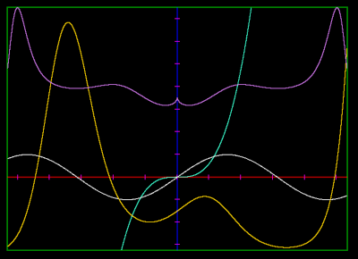
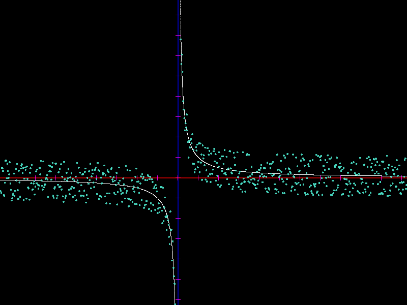

# graphlove.lua
A small and simple graphing library for Love2D.



The simplicity comes from eschewing antialiasing and infinite precision.
Graphlove doesn't graph a function itself, instead it takes an array of points
and maps them onto the screen.

## Usage
It's as easy as the following:

- Drop `graphlove.lua` into your project and require it:
   ```lua
   local graphlove = require("graphlove")
   ```
- Create a new graph:
   ```lua
   local graph = graphlove.new({
      curves = {
         {
            -- {x1, y1, x2, y2, x3 ...}
            points = {1, 1, 2, 2, 3, 3},
            radius = 3,
         }
      }
   })

   graphlove.update(graph)
   ```
- Draw the graph:
   ```lua
   function love.draw()
      graphlove.draw(graph)
   end
   ```
- If you wish to make the graph interactive:
   ```lua
   function love.update(dt)
      -- Use arrow keys and hjkl for controls by default
      graphlove.do_easy_controls(graph, dt)
   end
   ```

## Documentation
Read the examples section for an introduction. Then just read the code:
[`graphlove.lua`](./graphlove.lua). Seriously. It's thoroughly commented and
written to be as simple as possible at around 300 lines.

## Examples

### Interactive example
I highly recommend reading `example/main.lua` to see a slightly more complex use case.
You can run the included example with:
```
$ love example/
```

And this is what it should look like, two hyperbolae with a random cluster of
points around each of them:



That's me scrolling and scaling the graph, which you can also do using hjkl and
the arrow keys.

### Drawing the logo
To draw the graphs from the first screenshot, I used the following curves:
```lua
function gen_points(from, to, int, fn)
   local pts = {}
   for x=from, to, int do
      table.insert(pts, x)
      table.insert(pts, fn(x))
   end
   return pts
end

curves = {
   {
      color = {64/255, 224/225, 208/255, 1},
      points = gen_points(-20, 20, 0.001, function(x)
         return x^3 * 0.6
      end)
   },
   {
      color = {1, 1, 1, 1},
      points = gen_points(-20, 20, 0.01, math.sin)
   },
   {
      color = {1, 215/255, 0, 1},
      points = gen_points(-20, 20, 0.0001, function(x)
         return math.exp(x/2)^math.cos(x) * 2 - 3.5
      end)
   },
   {
      color = {0.8, 120/255, 230/255, 1},
      points = gen_points(-20, 20, 0.0001, function(x)
      local x = math.abs(x)
         return x^math.sin(x^math.cos(x)) + 2.5
      end)
   }
}
```

### Other examples
I use graphlove in one of the examples of my neural network library to show how
the model slowly approximates a function: http://github.com/Nikaoto/nn

## License (3-clause BSD)
```
Copyright 2022 Nikoloz Otiashvili.

Redistribution and use in source and binary forms, with or
without modification, are permitted provided that the following
conditions are met:

1. Redistributions of source code must retain the above copyright
   notice, this list of conditions and the following disclaimer.

2. Redistributions in binary form must reproduce the above
   copyright notice, this list of conditions and the following
   disclaimer in the documentation and/or other materials
   provided with the distribution.

3. Neither the name of the copyright holder nor the names of its
   contributors may be used to endorse or promote products
   derived from this software without specific prior written
   permission.

THIS SOFTWARE IS PROVIDED BY THE COPYRIGHT HOLDERS AND
CONTRIBUTORS "AS IS" AND ANY EXPRESS OR IMPLIED WARRANTIES,
INCLUDING, BUT NOT LIMITED TO, THE IMPLIED WARRANTIES OF
MERCHANTABILITY AND FITNESS FOR A PARTICULAR PURPOSE ARE
DISCLAIMED. IN NO EVENT SHALL THE COPYRIGHT HOLDER OR
CONTRIBUTORS BE LIABLE FOR ANY DIRECT, INDIRECT, INCIDENTAL,
SPECIAL, EXEMPLARY, OR CONSEQUENTIAL DAMAGES (INCLUDING, BUT NOT
LIMITED TO, PROCUREMENT OF SUBSTITUTE GOODS OR SERVICES; LOSS OF
USE, DATA, OR PROFITS; OR BUSINESS INTERRUPTION) HOWEVER CAUSED
AND ON ANY THEORY OF LIABILITY, WHETHER IN CONTRACT, STRICT
LIABILITY, OR TORT (INCLUDING NEGLIGENCE OR OTHERWISE) ARISING IN
ANY WAY OUT OF THE USE OF THIS SOFTWARE, EVEN IF ADVISED OF THE
POSSIBILITY OF SUCH DAMAGE.
```

